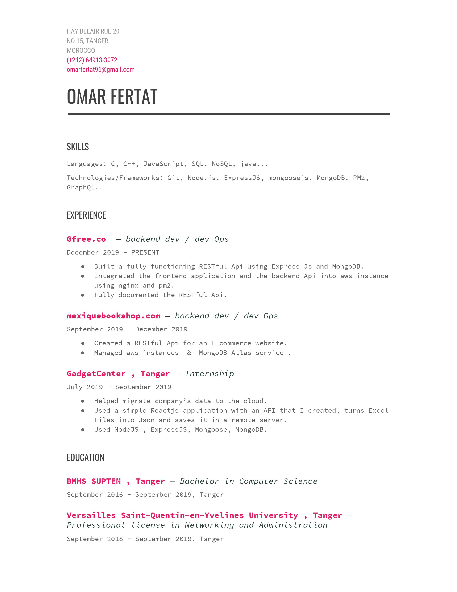

# Omar Fertat
 Welcome to Omar Fertat job application!
>This site was created using [**Docsify**](https://docsify.js.org).

This site was created by Omar Fertat for Backend developer application at [**www.obytes.com**](https://www.obytes.com).

>[**Job refrence**](https://www.obytes.com/jobs/backend-developer)

## Who ?

a little introduction

```js
const UserSchema= mongoose.Schema({
    fullName: "omar fertat",
    age:24,
    location: "Tangier, Morocco",
    education:[
        {
            university: "BMHS Suptem Tanger",
            degree: "computer science",
            year: "2019"
        },
        {
            university:"Versailles Saint-Quentin-en-Yvelines",
            degree:"Professional license in Networking and Administration",
            year:"2019"
        }
    ],
    occupation:" Backend DEV",    
    CoreSkills:[{skill:"Nodejs"},{skill:"Expressjs"},{skill:"NOSQL"},{skill:"RESTful API"},{skill:"AWS"},{skill:"docsify"}],
    contactInfo:{
        Email:"omarfertat96@gmail.com",
        phone:"+212 649 133 072"
    },
    experince:[
        {
            Link:"mexiquebookshop.com/",
            position:"backend dev + devOps"
        },
        {
            Link:"Gfree.co",
            position:"backend dev + devOps"
        }
    ]
})

```
# Skills
## Languages
JavaScript, java, C, C++...
## Technologies/Frameworks
 Git, Node.js, ExpressJS, mongoosejs, MongoDB, PM2, GraphQL, NOSQL...

# Education 

## BMHS SUPTEM , Tanger — Bachelor in Computer Science

>September 2016 - September 2019, Tanger

## Versailles Saint-Quentin-en-Yvelines University , Tanger — Professional license in Networking and Administration

>September 2018 - September 2019, Tanger


# Experince

## Gfree.co  — backend dev / dev Ops
> December 2019 - PRESENT
```text
Built a fully functioning RESTful Api using Express Js and MongoDB. 
Integrated the frontend application and the backend Api into aws instance using nginx and pm2. 
Fully documented the RESTful Api.
```
## mexiquebookshop.com — backend dev / dev Ops
> September 2019 - December 2019
```text
Created a RESTful Api for an E-commerce website.
Managed aws instances  &  MongoDB Atlas service .
```
# CLassic Resume
